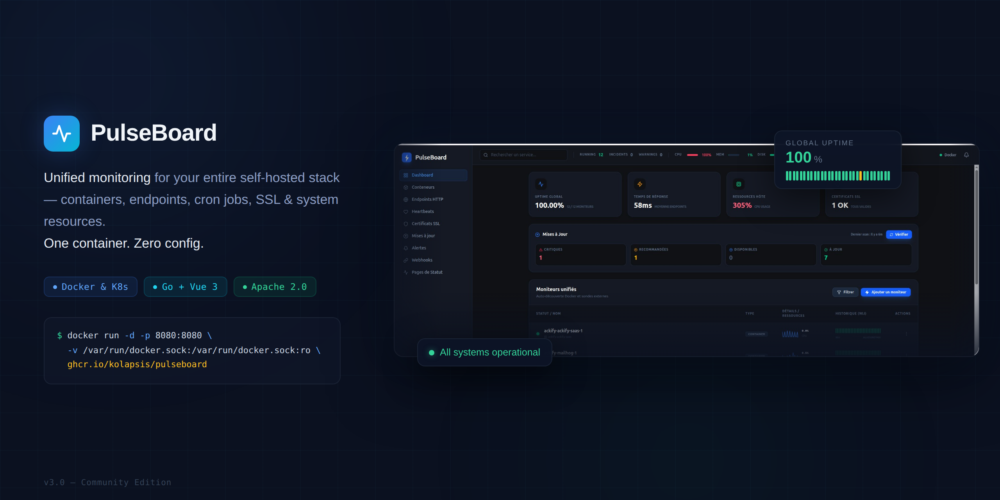

<p align="center">
  
</p>

<h1 align="center">PulseBoard</h1>

<p align="center">
  <strong>The all-in-one monitoring dashboard your self-hosted stack deserves.</strong><br>
  Drop a single container. Watch everything. Sleep at night.
</p>

<p align="center">
  <a href="#quick-start">Quick Start</a>  |  
  <a href="#features">Features</a>  |  
  <a href="#configuration">Configuration</a>  |  
  <a href="#api">API</a>  |  
  <a href="#contributing">Contributing</a>
</p>

<!-- TODO: Uncomment when CI badges are set up
<p align="center">
  
  
  
</p>
-->

---

## Why PulseBoard?

Most self-hosters juggle 3-5 tools to monitor their stack: one for containers, one for uptime, one for certs, one for metrics, and yet another for a status page. PulseBoard replaces all of them.

|                              | PulseBoard | Uptime Kuma | Portainer  | Dozzle     |
| ---------------------------- |:----------:|:-----------:|:----------:|:----------:|
| Container auto-discovery     | **Yes**    | No          | Yes        | Yes        |
| HTTP/TCP endpoint checks     | **Yes**    | Yes         | No         | No         |
| Cron/heartbeat monitoring    | **Yes**    | Yes         | No         | No         |
| SSL certificate tracking     | **Yes**    | Yes         | No         | No         |
| CPU/memory/network metrics   | **Yes**    | No          | Limited    | No         |
| Image update detection       | **Yes**    | No          | Yes        | No         |
| Public status page           | **Yes**    | Yes         | No         | No         |
| Alerting (webhook, Discord)  | **Yes**    | Yes         | Limited    | No         |
| Kubernetes native            | **Yes**    | No          | Yes        | No         |
| Single binary, zero deps     | **Yes**    | Node.js     | Docker API | Docker API |

**One container. One dashboard. Everything monitored.**

---

## Quick Start

### Docker (30 seconds)

```yaml
# docker-compose.yml
services:
  pulseboard:
    image: ghcr.io/kolapsis/pulseboard:latest
    ports:
      - "8080:8080"
    volumes:
      - /var/run/docker.sock:/var/run/docker.sock:ro
      - pulseboard-data:/data
    environment:
      PULSEBOARD_DB: "/data/pulseboard.db"
    restart: unless-stopped

volumes:
  pulseboard-data:
```

```bash
docker compose up -d
```

Open **http://localhost:8080** — your containers are already there. No configuration needed.

### Kubernetes

```bash
kubectl apply -f deploy/kubernetes/
```

PulseBoard auto-detects the in-cluster API. Read-only RBAC, namespace filtering, workload-level monitoring out of the box.

---

## Features

### Container Monitoring

Zero-config auto-discovery for Docker and Kubernetes. Every container is tracked the moment it starts — state changes, health checks, restart loops, log streaming with stdout/stderr demux. Compose projects are auto-grouped. Kubernetes workloads (Deployments, DaemonSets, StatefulSets) are first-class citizens.

### Endpoint Monitoring

Define HTTP or TCP checks directly as Docker labels — no config files, no UI clicks. PulseBoard picks them up automatically when a container starts. Response times, uptime history, 90-day sparklines, configurable failure/recovery thresholds.

```yaml
labels:
  pulseboard.endpoint.http: "https://api:3000/health"
  pulseboard.endpoint.interval: "15s"
  pulseboard.endpoint.failure-threshold: "3"
```

### Heartbeat & Cron Monitoring

Create a monitor, get a unique URL, add one `curl` to your cron job. PulseBoard tracks start/finish times, durations, exit codes, and alerts you when a job misses its deadline.

```bash
# One-liner for any cron job
curl -fsS -o /dev/null https://pulse.example.com/ping/{uuid}/$?
```

### SSL/TLS Certificate Monitoring

Automatic detection from your HTTPS endpoints, plus standalone monitors for any domain. Alerts at 30, 14, 7, 3, and 1 day before expiry. Full chain validation.

### Resource Metrics

Real-time CPU, memory, network I/O, and disk I/O per container. Historical charts from 1 hour to 7 days. Per-container alert thresholds with debounce to avoid noise. Top consumers view for instant triage.

### Update Intelligence

Knows when your images have updates available. Scans OCI registries, compares digests. Stop running `docker pull` blindly.

### Alert Engine

Unified alerts across all monitoring sources. Webhook and Discord channels included. Silence rules for planned maintenance. Exponential backoff retry on delivery. Slack, Teams, and email channels available with PulseBoard Pro.

### Public Status Page

Give your users a clean status page. Component groups, incident management.

---

## Configuration

### Environment Variables

| Variable                            | Default                 | Description                                     |
| ----------------------------------- | ----------------------- | ----------------------------------------------- |
| `PULSEBOARD_ADDR`                   | `127.0.0.1:8080`        | HTTP bind address                               |
| `PULSEBOARD_DB`                     | `./pulseboard.db`       | SQLite database path                            |
| `PULSEBOARD_BASE_URL`               | `http://localhost:8080` | Base URL (used for heartbeat ping URLs)         |
| `PULSEBOARD_CORS_ORIGINS`           | same-origin             | CORS allowed origins (comma-separated)          |
| `PULSEBOARD_RUNTIME`                | auto-detect             | Force `docker` or `kubernetes`                  |
| `PULSEBOARD_MAX_BODY_SIZE`          | `1048576`               | Max request body size in bytes (1 MB)           |
| `PULSEBOARD_UPDATE_INTERVAL`        | `24h`                   | Update intelligence scan interval (Go duration) |
| `PULSEBOARD_K8S_NAMESPACES`         | all                     | Namespace allowlist (comma-separated)           |
| `PULSEBOARD_K8S_EXCLUDE_NAMESPACES` | none                    | Namespace blocklist                             |

### Docker Labels Reference

<details>
<summary><strong>Container settings</strong></summary>

```yaml
labels:
  pulseboard.ignore: "true"                    # Exclude from monitoring
  pulseboard.group: "backend"                  # Custom group name
  pulseboard.alert.severity: "critical"        # critical | warning | info
  pulseboard.alert.restart_threshold: "5"      # Restart loop threshold
  pulseboard.alert.channels: "ops-webhook"      # Route to specific channels
```

</details>

<details>
<summary><strong>Endpoint monitoring</strong></summary>

```yaml
labels:
  # Simple — one endpoint per container
  pulseboard.endpoint.http: "https://app:8443/health"
  pulseboard.endpoint.tcp: "db:5432"

  # Indexed — multiple endpoints per container
  pulseboard.endpoint.0.http: "https://app:8443/health"
  pulseboard.endpoint.1.tcp: "redis:6379"

  # Tuning
  pulseboard.endpoint.interval: "30s"
  pulseboard.endpoint.timeout: "10s"
  pulseboard.endpoint.http.method: "POST"
  pulseboard.endpoint.http.expected-status: "200,201"
  pulseboard.endpoint.http.tls-verify: "false"
  pulseboard.endpoint.http.headers: '{"Authorization":"Bearer tok"}' # or key=val,key=val
  pulseboard.endpoint.http.max-redirects: "3"
  pulseboard.endpoint.failure-threshold: "3"
  pulseboard.endpoint.recovery-threshold: "2"
```

</details>

<details>
<summary><strong>TLS certificate monitoring</strong></summary>

```yaml
labels:
  pulseboard.tls.certificates: "example.com:443,api.example.com:443"  # Explicit TLS targets
```

</details>

<details>
<summary><strong>Full stack example</strong></summary>

```yaml
services:
  pulseboard:
    image: ghcr.io/kolapsis/pulseboard:latest
    ports:
      - "8080:8080"
    volumes:
      - /var/run/docker.sock:/var/run/docker.sock:ro
      - pulseboard-data:/data
    environment:
      PULSEBOARD_DB: "/data/pulseboard.db"

  api:
    image: myapp:latest
    labels:
      pulseboard.group: "production"
      pulseboard.endpoint.http: "http://api:3000/health"
      pulseboard.endpoint.interval: "15s"
      pulseboard.alert.severity: "critical"
      pulseboard.alert.channels: "ops-webhook"

  postgres:
    image: postgres:16
    labels:
      pulseboard.endpoint.tcp: "postgres:5432"
      pulseboard.alert.severity: "critical"

  redis:
    image: redis:7-alpine
    labels:
      pulseboard.endpoint.tcp: "redis:6379"

volumes:
  pulseboard-data:
```

</details>

---

## Security Model

PulseBoard does not include built-in authentication — by design.

Like Dozzle, Prometheus, and most self-hosted monitoring tools, PulseBoard is designed to sit behind your existing reverse proxy + auth middleware. No need to manage yet another set of user accounts.

```
Internet  ->  Reverse Proxy (Traefik / Caddy / nginx)
          ->  Auth (Authelia / Authentik / OAuth2 Proxy)
          ->  PulseBoard
```

<details>
<summary><strong>Example: Traefik + Authelia</strong></summary>

```yaml
services:
  pulseboard:
    image: ghcr.io/kolapsis/pulseboard:latest
    labels:
      traefik.enable: "true"
      traefik.http.routers.pulseboard.rule: "Host(`pulse.example.com`)"
      traefik.http.routers.pulseboard.middlewares: "authelia@docker"
    volumes:
      - /var/run/docker.sock:/var/run/docker.sock:ro
      - pulseboard-data:/data
    environment:
      PULSEBOARD_DB: "/data/pulseboard.db"
      PULSEBOARD_BASE_URL: "https://pulse.example.com"
```

</details>

> **Note:** `/ping/{uuid}` (heartbeat pings) and `/status/` (public status page) are meant to be publicly accessible. Configure your proxy rules accordingly.

---

## Alert Sources

| Source      | Events                                 | Default Severity  |
| ----------- | -------------------------------------- | ----------------- |
| Container   | `restart_loop`, `health_unhealthy`     | Warning           |
| Endpoint    | `consecutive_failure`                  | Critical          |
| Heartbeat   | `deadline_missed`                      | Critical          |
| Certificate | `expiring`, `expired`, `chain_invalid` | Critical          |
| Resource    | `cpu_threshold`, `memory_threshold`    | Warning           |
| Update      | `available`                            | Info              |

Deliver to Discord or any HTTP webhook. Slack, Teams, and email available with PulseBoard Pro.

---

## API

Full REST API under `/api/v1/` for automation and integration.

<details>
<summary><strong>Endpoint reference</strong></summary>

| Resource     | Endpoints                                                                                               |
| ------------ | ------------------------------------------------------------------------------------------------------- |
| Containers   | `GET /containers` `GET /containers/{id}` `GET /containers/{id}/transitions` `GET /containers/{id}/logs` |
| Endpoints    | `GET /endpoints` `GET /endpoints/{id}` `GET /endpoints/{id}/checks` `GET /endpoints/{id}/uptime/daily`  |
| Heartbeats   | `GET POST /heartbeats` `GET PUT DELETE /heartbeats/{id}` `POST /heartbeats/{id}/pause\|resume`          |
| Certificates | `GET POST /certificates` `GET PUT DELETE /certificates/{id}`                                            |
| Resources    | `GET /containers/{id}/resources/current\|history` `GET /resources/summary\|top`                         |
| Alerts       | `GET /alerts` `GET /alerts/active` `GET POST /channels` `GET POST /silence`                             |
| Webhooks     | `GET POST /webhooks` `POST /webhooks/{id}/test`                                                         |
| Status Page  | `GET POST /status/groups\|components\|incidents\|maintenance`                                           |
| Updates      | `GET /updates` `POST /updates/scan`                                                                     |
| Events       | `GET /containers/events` *(SSE stream)*                                                                 |
| Health       | `GET /health`                                                                                           |

</details>

---

## Architecture

```
┌──────────────────────────────────────────────────────┐
│                  Single Go Binary                    │
│                                                      │
│   ┌────────────────────────────────────────────┐     │
│   │  Vue 3 + TypeScript + Tailwind (embed.FS)  │     │
│   │  Real-time SSE  ·  uPlot charts  ·  PWA    │     │
│   └────────────────────────────────────────────┘     │
│                         |                            │
│   ┌────────────────────────────────────────────┐     │
│   │           REST API v1 + SSE Broker         │     │
│   └────────────────────────────────────────────┘     │
│          |                          |                │
│   ┌─────────────┐  ┌──────────────────────┐         │
│   │   Docker     │  │     Kubernetes       │         │
│   │   Runtime    │  │     Runtime          │         │
│   └─────────────┘  └──────────────────────┘         │
│          |                          |                │
│   ┌────────────────────────────────────────────┐     │
│   │  Containers · Endpoints · Heartbeats ·     │     │
│   │  Certificates · Resources · Alerts ·       │     │
│   │  Updates · Status Page · Webhooks          │     │
│   └────────────────────────────────────────────┘     │
│                         |                            │
│   ┌────────────────────────────────────────────┐     │
│   │     SQLite  (WAL · single-writer · zero    │     │
│   │              external dependencies)        │     │
│   └────────────────────────────────────────────┘     │
└──────────────────────────────────────────────────────┘
```

**Design philosophy:**

- **Single binary** — Frontend embedded in Go via `embed.FS`. One file to deploy.
- **Zero dependencies** — SQLite is the only database. No Redis, no Postgres, no message queue.
- **Real-time by default** — SSE pushes every state change to the browser instantly.
- **Read-only** — PulseBoard never touches your containers. Observe only.
- **Label-driven** — Configure monitoring through Docker labels. No YAML files to maintain.
- **Runtime-agnostic** — Docker and Kubernetes behind a common interface, auto-detected at startup.

---

## Development

```bash
# Frontend
cd frontend && npm install && npm run build

# Backend (embeds frontend dist/)
go build -o pulseboard ./cmd/pulseboard

# Run
./pulseboard
```

**Requirements:** Go >= 1.25 · Node.js >= 20 · CGO enabled · Docker (for testing)

<details>
<summary><strong>Project structure</strong></summary>

```
cmd/pulseboard/            Entry point, service wiring
internal/
  api/v1/                  HTTP handlers, SSE broker, router
  container/               Container model, service, uptime
  docker/                  Docker runtime
  kubernetes/              Kubernetes runtime
  runtime/                 Runtime abstraction interface
  endpoint/                Endpoint monitoring
  heartbeat/               Heartbeat/cron monitoring
  certificate/             TLS certificate monitoring
  resource/                Resource metrics
  alert/                   Alert engine, notifier
  update/                  Update intelligence
  status/                  Public status page
  webhook/                 Webhook dispatcher
  store/sqlite/            Store layer, migrations, writer

frontend/src/
  pages/                   Vue page components
  components/              Reusable UI components
  stores/                  Pinia stores (SSE-connected)
  services/                API client services
```

</details>

---

## Editions

PulseBoard is available in two editions:

| Feature | Community | Pro |
|---------|:---------:|:---:|
| Container auto-discovery | x | x |
| Endpoint monitoring (HTTP/TCP) | x | x |
| Heartbeat/cron monitoring | x (10 max) | x (unlimited) |
| TLS certificate monitoring | x | x |
| Resource metrics | x | x |
| Update intelligence (digest scan) | x | x |
| Alert engine (fire, recover, silence) | x | x |
| Webhook + Discord channels | x | x |
| Public status page (components, groups) | x | x |
| REST API + SSE | x | x |
| PWA support | x | x |
| Slack, Teams, Email channels | | x |
| Alert escalation + routing | | x |
| Maintenance windows | | x |
| Alert templates | | x |
| CVE enrichment + risk scoring | | x |
| Incident management | | x |
| Subscriber notifications | | x |

The Community Edition is fully functional for self-hosted monitoring. PulseBoard Pro adds advanced alerting, notification channels, and enterprise features.

PulseBoard Pro is available as a separate commercial product.

---

## Contributing

Contributions are welcome! Please open an issue first to discuss what you'd like to change.

---

## License

Copyright 2026 kOlapsis (Benjamin Touchard)

Licensed under the [Business Source License 1.1](LICENSE) (BSL 1.1).

**You can use PulseBoard freely** for personal use, internal business use, and non-commercial purposes. The only restriction is offering PulseBoard as a competing hosted service.

Each version converts to [Apache License 2.0](https://www.apache.org/licenses/LICENSE-2.0) four years after release.
